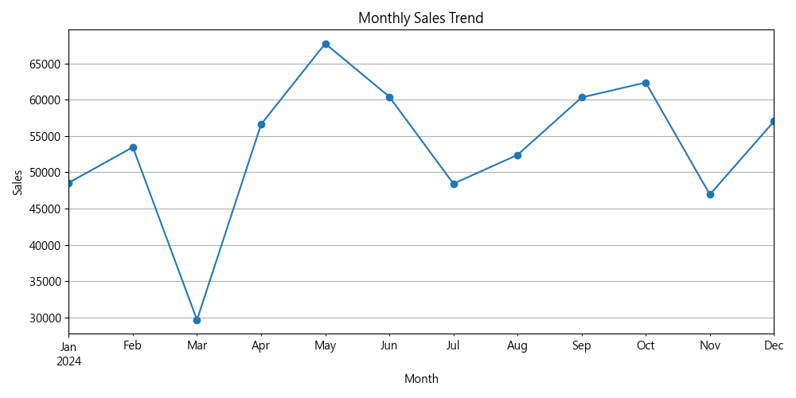
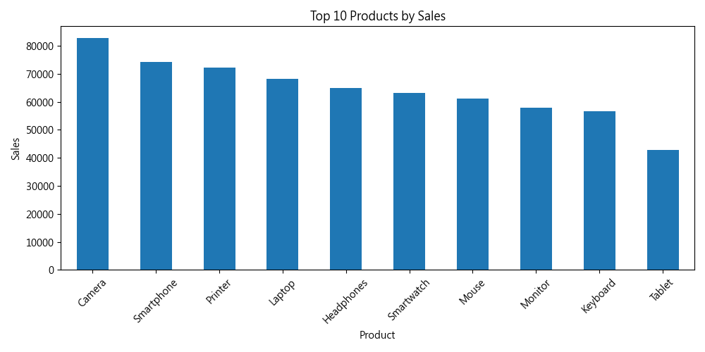
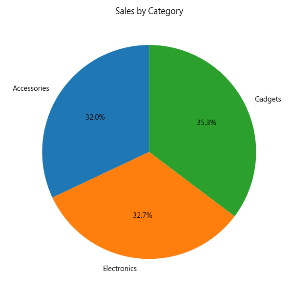
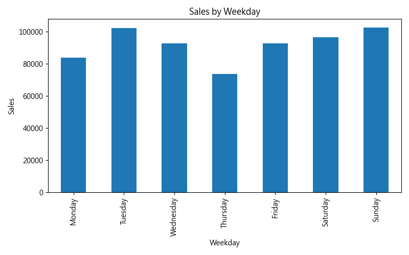
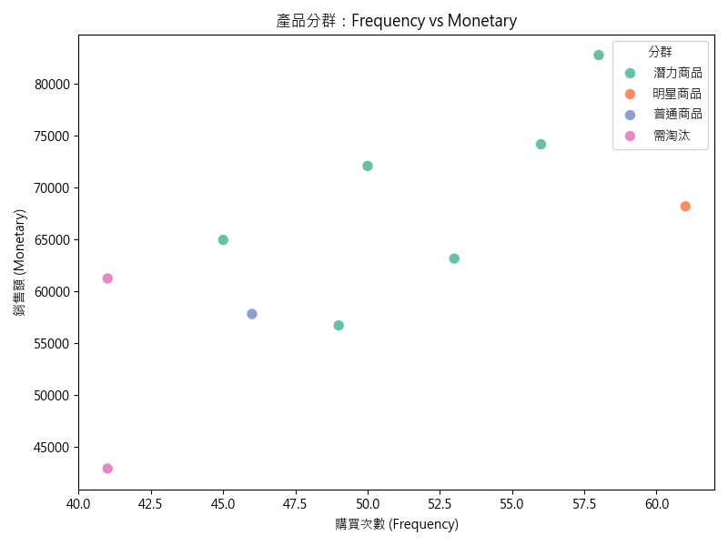
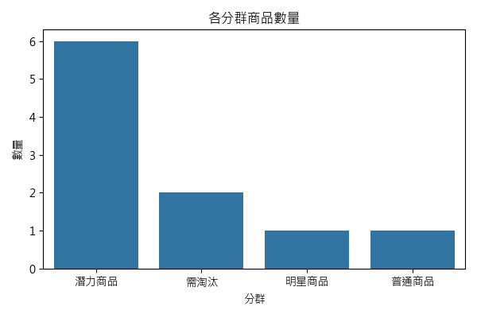

# 電商銷售數據分析 (E-commerce Sales Analysis)

## 專案簡介
本專案使用 Python (pandas、matplotlib、seaborn) 進行電商銷售資料的清理、分析與可視化。  
分析重點包含銷售趨勢、暢銷商品、產品類別銷售佔比、週銷售表現，以及基於產品的 RFM 分群。

資料來源：模擬電商交易資料集 (Excel)

---

## 分析步驟
1. **資料清理**  
   - 處理日期格式
   - 建立 YearMonth 欄位
2. **銷售分析**  
   - 每月銷售趨勢
   - Top 10 暢銷商品
   - 產品類別銷售佔比
   - 週銷售表現 (找出哪天銷售最好)
3. **進階分析**  
   - 產品層級 RFM 分群
   - RFM 視覺化 (散點圖 + 分群數量長條圖)

---

## 商業分析洞察
1. **銷售高峰月份**：分析結果顯示，每年特定月份銷售額明顯成長，建議提前備貨並規劃促銷活動。
2. **明星商品**：少數商品貢獻主要銷售額，應重點維護庫存及廣告資源。
3. **潛力商品**：銷售頻率不高但金額潛力大，可嘗試限時促銷以測試市場。
4. **需淘汰商品**：銷售低迷的商品可考慮下架或折扣清倉，降低庫存壓力。
5. **銷售時機**：週末銷售量高於平日，建議週末加強廣告投放與促銷。

---

## 主要圖表
### 每月銷售趨勢

### Top 10 商品

### 類別銷售佔比

### 週銷售趨勢

### RFM 分群散點圖

### 各分群商品數量

---

## 使用技術
- Python (pandas、matplotlib、seaborn)
- Jupyter Notebook
- GitHub

---

## 作者
[蕭妤卉]  
作品集用途：轉職數據分析師